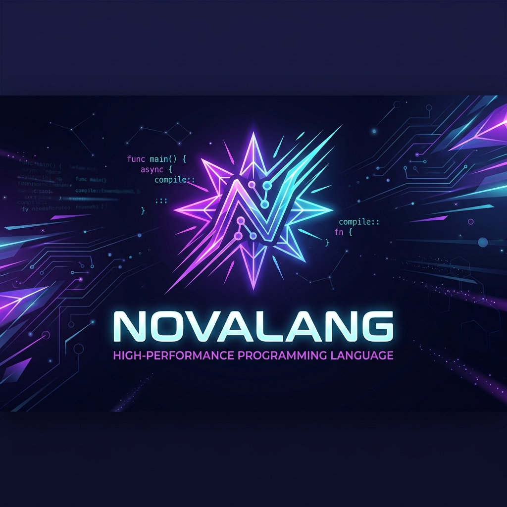
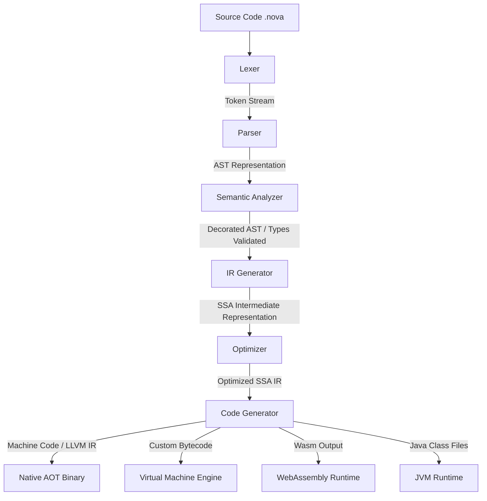

# 🌟 NovaLang: The Universal Programming Language



> **NovaLang** is a next-generation, multi-paradigm programming language designed to unify systems programming, scripting, application development, AI/ML, and embedded systems into a single cohesive ecosystem. It eliminates the classic trade-off between execution speed and developer velocity.

---

## 🚀 Key Features

* **Dual Execution Pipeline:** Seamless support for Ahead-of-Time (AOT) native compilation, Just-in-Time (JIT) compilation, and high-performance VM interpretation.
* **Gradual & Optional Typing:** Write rapid scripts with dynamic typing, or enforce compile-time type-safety with static type annotations.
* **System-Level & Safe Memory:** Enjoy automated generational garbage collection by default, with low-level raw pointer access inside explicit `unsafe` blocks.
* **Modern Language Constructs:** Built-in pattern matching, asynchronous routines (`async`/`await`), first-class lambdas, interfaces, and generic types.
* **Cross-Platform:** Target desktop (Windows, macOS, Linux), mobile (Android, iOS), Web (WebAssembly), and microcontrollers.

---

## 📐 Compilation & Execution Pipeline



---

## 💻 Language Syntax Showcase

### 1. Variables and Gradual Typing
```typescript
// Read-only binding
let name = "Manik"    

// Mutable statically-typed variable (no keyword required)
age: Int = 21         

// Statically-typed assignment check
// age = "twenty" -> Raises TypeError: Expected Int, got String

// Dynamic variable using automatic type detection (implicit definition)
value = 21            
value = "Hello"       // Statically validated at runtime upon re-assignment
```

### 2. Reusable Functions
```typescript
fun add(a: Int, b: Int): Int {
    return a + b
}

let result = add(5, 15) // result is 20
```

### 3. Object-Oriented Programming (Classes & Interfaces)
```typescript
interface Vehicle {
    fun start()
}

class Car extends Vehicle {
    name: String
    
    init(name: String) {
        self.name = name
    }
    
    fun start() {
        print("Engine started for " + self.name)
    }
}
```

### 4. Pattern Matching
```rust
let x = 2
match x {
    1 => { print("One") }
    2 => { print("Two") }
    _ => { print("Other") }
}
```

---

## 🛠️ Getting Started (Reference Implementation)

Currently, the repository contains the **Phase 1 Reference Implementation** written in Python. It includes a Lexer, recursive-descent Parser, AST walking Interpreter, and an interactive REPL.

### Prerequisites
* **Python 3.13** or higher.

### Running a `.nova` File
To run a NovaLang script:
```bash
python -m novalang.main path/to/file.nova
```

### Launching the Interactive REPL
To write NovaLang code interactively:
```bash
python -m novalang.main
```
Example session:
```text
NovaLang Interactive REPL (v1.3.0)
Press Ctrl+C to clear current line, Ctrl+D to exit.
nova> x = 10
nova> y = 20
nova> let z = x + y * 2
nova> print(z)
50
```

---

## 🧪 Verification & Testing

NovaLang utilizes Python's built-in `unittest` framework to verify correct tokenization, parsing, AST generation, and execution states.

To run the automated test suite:
```bash
python run_tests.py
```

All core components (Lexer, Parser, AST, Interpreter, and REPL) are validated against strict criteria, including static type boundary checks and structural scoping.

---

## 📅 Roadmap & Project Plan

The development of NovaLang is organized into iterative Sprints:

| Sprint | Phase | Focus | Scope |
| :--- | :--- | :--- | :--- |
| **Sprint 1 & 2** | Foundation | Lexical & Syntax | Lexer, Parser, AST representation, and Type-safety checks. |
| **Sprint 3 & 4** | Execution | Interpreter & AOT | Interactive REPL, AST walking interpreter, and LLVM backend integration. |
| **Sprint 5 & 6** | Runtime | VM & Packaging | Stack-based Virtual Machine, nursery GC, and the package manager `nova`. |
| **Sprint 7 & 8** | Ecosystem | Standard Lib & IDE | IO/Math/Network libraries, LSP Language Server, and DAP integration. |

For a complete breakdown of requirements and architecture design choices, please refer to the [Software Requirements Specification (SRS)](./SRS.md) and the [Software Development Life Cycle (SDLC)](./SDLC.md) documents.

---

## 📄 License
This project is licensed under the MIT License - see the LICENSE file for details.
