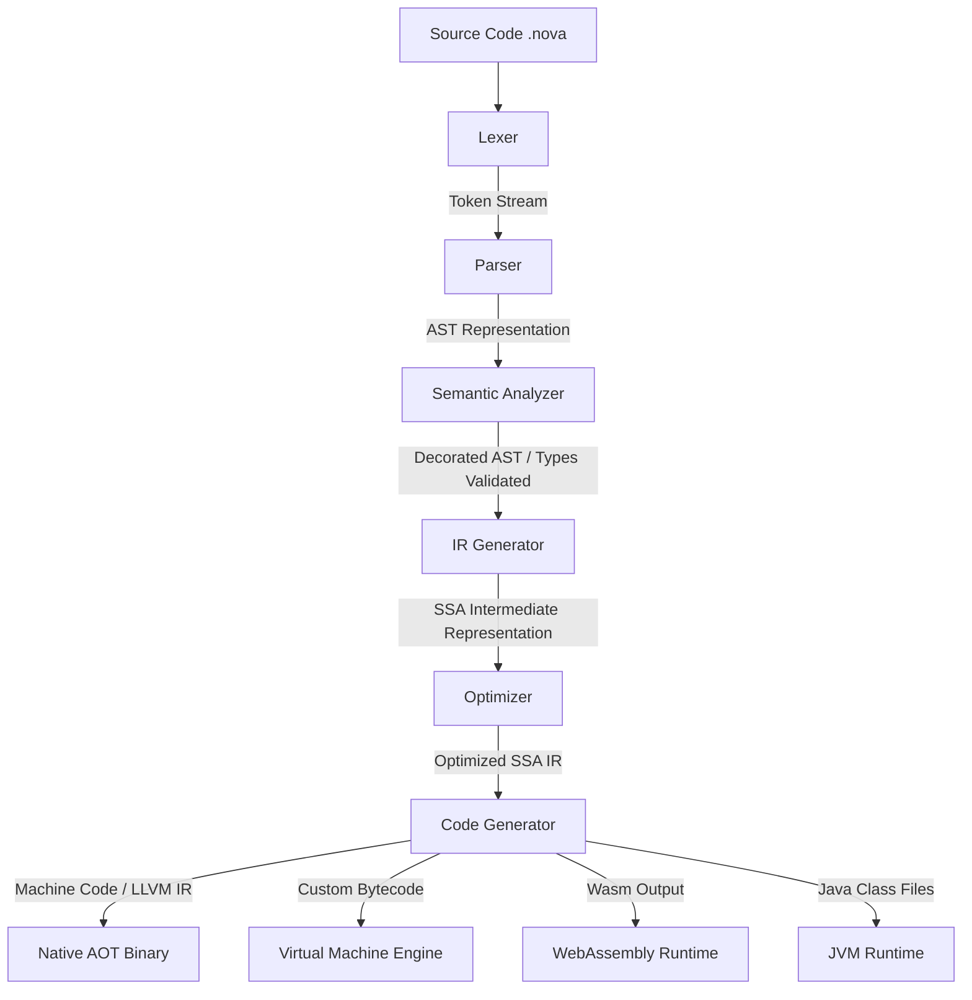

# 🌟 NovaLang: The Universal Programming Language


> **NovaLang** is a next-generation, multi-paradigm programming language designed to unify systems programming, scripting, application development, AI/ML, and embedded systems into a single cohesive ecosystem. It eliminates the classic trade-off between execution speed and developer velocity.

---

## 🚀 Key Features

* **Dual Execution Pipeline:** Seamless support for Ahead-of-Time (AOT) native compilation, Just-in-Time (JIT) compilation, and high-performance VM interpretation.
* **Gradual & Optional Typing:** Write rapid scripts with dynamic typing, or enforce compile-time type-safety with static type annotations.
* **System-Level & Safe Memory:** Enjoy automated generational garbage collection by default, with low-level raw pointer access inside explicit `unsafe` blocks.
* **Modern Language Constructs:** Built-in pattern matching, asynchronous routines (`async`/`await`), first-class lambdas, interfaces, and generic types.
* **Cross-Platform:** Target desktop (Windows, macOS, Linux), mobile (Android, iOS), Web (WebAssembly), and microcontrollers.

---

## 📐 Compilation & Execution Pipeline



---

## 💻 Language Syntax Showcase

### 1. Variables and Gradual Typing
```typescript
// Read-only binding
let name = "Manik"    

// Mutable statically-typed variable (no keyword required)
age: Int = 21         

// Statically-typed assignment check
// age = "twenty" -> Raises TypeError: Expected Int, got String

// Dynamic variable using automatic type detection (implicit definition)
value = 21            
value = "Hello"       // Statically validated at runtime upon re-assignment
```

### 2. Reusable Functions
```typescript
fun add(a: Int, b: Int): Int {
    return a + b
}

let result = add(5, 15) // result is 20
```

### 3. Object-Oriented Programming (Classes & Interfaces)
```typescript
interface Vehicle {
    fun start()
}

class Car extends Vehicle {
    name: String
    
    init(name: String) {
        self.name = name
    }
    
    fun start() {
        print("Engine started for " + self.name)
    }
}
```

### 4. Pattern Matching
```rust
let x = 2
match x {
    1 => { print("One") }
    2 => { print("Two") }
    _ => { print("Other") }
}
```

---

## 🛠️ Getting Started & CLI Usage

NovaLang includes a unified CLI package manager and execution tool. Use the wrapper script `.\nova.bat` (Windows) or `./nova` (Unix) to invoke subcommands:

### Prerequisites
* **Python 3.13** or higher.
* **LLVM Clang Compiler** (optional, required for Ahead-of-Time native binary compilation).

### Subcommands
* **`init <project_name>`**: Initialize a new standard modular project with configuration manifests.
* **`run [file]`**: Execute a `.nova` file or compiled `.novac` bytecode. Add `--vm` flag to run via the stack-based Virtual Machine.
* **`build [file]`**: Compile a `.nova` script. By default, compiles Ahead-of-Time (AOT) to LLVM IR (`.ll`) and native binary (`.exe` via Clang). Add `--vm` to compile to Virtual Machine bytecode (`.novac`).
* **`repl`**: Run the interactive Read-Eval-Print Loop.
* **`debug [file]`**: Launch the step-by-step console-based bytecode debugger.
* **`lsp`**: Start the JSON-RPC Language Server daemon for IDE code diagnostics, hover tooltips, and autocomplete.

---

## 📦 Standard Library Package (`novalang/stdlib/`)

NovaLang features a modularized standard library separated into separate files under `novalang/stdlib/`:

* **`import math`**: `sqrt(x)`, `sin(x)`, `cos(x)`, `abs(x)`, `min(a,b)`, `max(a,b)`
* **`import string`**: `upper(s)`, `lower(s)`, `split(s, sep)`, `join(items, sep)`
* **`import io`**: `readline()`, `readfile(path)`, `writefile(path, content)`
* **`import net`**: `request(url)`, `listen(port)`
* **`import crypto`**: `sha256(s)`, `md5(s)`
* **`import db`**: `connect(url)`, `query(conn, sql)`
* **`import ai`**: `dot_product(v1, v2)`, `sigmoid(x)`
* **`import collection`**: `list()`, `list_add(l, val)`, `list_get(l, idx)`, `list_len(l)`, `map()`, `map_set(m, k, v)`, `map_get(m, k)`, `map_has(m, k)`


---

## 📦 Packaging & Distribution

NovaLang can be packaged for release as a Python package wheel or compiled to a standalone executable binary using the included build system:

### 1. Build a Release
Run the automated build script to generate packages in the `dist/` directory:
```bash
python build_release.py
```
This automatically produces:
* **Python Package Wheel (`.whl`) & Source Tarball (`.tar.gz`)**: For standard pip distribution.
* **Standalone Binary Executable (`nova` or `nova.exe`)**: Built via PyInstaller (if installed with `pip install pyinstaller`).

### 2. Installation
To install the package locally so that the `nova` CLI command is available globally:
```bash
pip install .
```
Alternatively, install the built wheel file directly:
```bash
pip install dist/novalang-1.0.0-py3-none-any.whl
```
Once installed, you can invoke the CLI from anywhere on your system:
```bash
nova repl
```

---

## 🧪 Verification & Testing

NovaLang utilizes Python's built-in `unittest` framework to verify correct tokenization, parsing, AST generation, and execution states across all targets (Interpreter, VM, and LLVM/Clang Compiler).

To run the automated test suite:
```bash
python run_tests.py
```

All core components and standard library operations are validated against strict type checks, scoping, and generational nursery garbage collection.

---

## 📅 Roadmap & Project Plan

The development of NovaLang is organized into iterative Sprints:

| Sprint | Phase | Focus | Scope |
| :--- | :--- | :--- | :--- |
| **Sprint 1 & 2** | Foundation | Lexical & Syntax | Lexer, Parser, AST representation, and Type-safety checks. |
| **Sprint 3 & 4** | Execution | Interpreter & AOT | Interactive REPL, AST walking interpreter, and LLVM backend integration. |
| **Sprint 5 & 6** | Runtime | VM & Packaging | Stack-based Virtual Machine, nursery GC, and the package manager `nova`. |
| **Sprint 7 & 8** | Ecosystem | Standard Lib & IDE | IO/Math/Network libraries, LSP Language Server, and DAP integration. |

For a complete breakdown of requirements and architecture design choices, please refer to the [Software Requirements Specification (SRS)](./SRS.md) and the [Software Development Life Cycle (SDLC)](./SDLC.md) documents.

---

## 📄 License
This project is licensed under the MIT License - see the LICENSE file for details.
