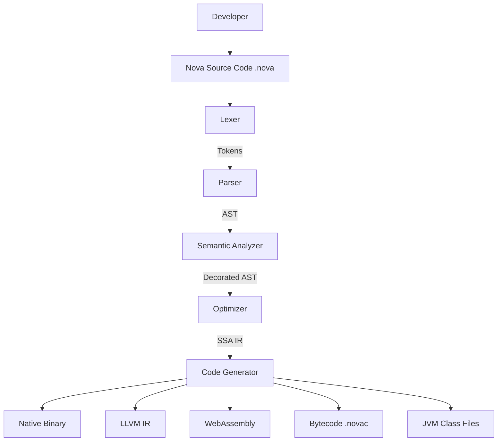
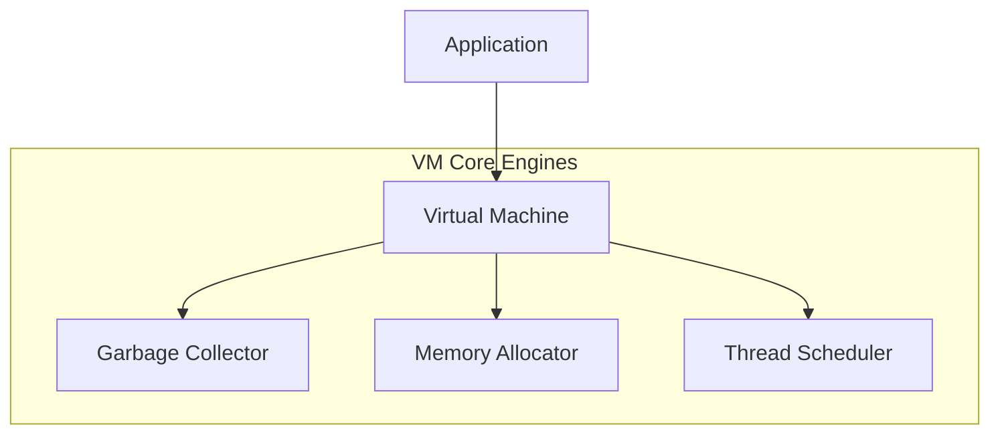
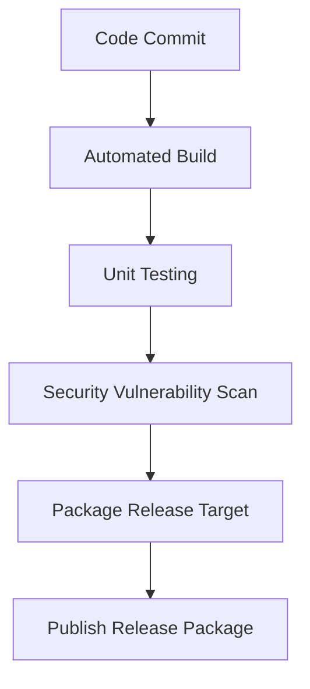

# Software Development Life Cycle (SDLC)
## Project: NovaLang – Universal Programming Language

---

## Document Control
* **Document Version:** 1.0.0
* **Date:** 2026-06-06
* **Status:** Approved / Active
* **Category:** Project Management & Development Framework
* **Authors:** Manik Patra <manikpatra409@gmail.com>

---

## Table of Contents
1. [Project Overview](#1-project-overview)
2. [Planning Phase](#2-planning-phase)
3. [Requirement Analysis Phase](#3-requirement-analysis-phase)
4. [System Design Phase](#4-system-design-phase)
5. [UI/UX Design Phase](#5-uiux-design-phase)
6. [Development Phase (Sprint Breakdown)](#6-development-phase-sprint-breakdown)
7. [Testing Phase](#7-testing-phase)
8. [Deployment Phase](#8-deployment-phase)
9. [Maintenance Phase](#9-maintenance-phase)
10. [DevOps & CI/CD](#10-devops--cicd)
11. [Team Structure](#11-team-structure)
12. [Risk Management](#12-risk-management)
13. [Project Roadmap & Final Deliverables](#13-project-roadmap--final-deliverables)

---

## 1. Project Overview

| Metric | Project Specification |
| :--- | :--- |
| **Project Name** | NovaLang |
| **Project Type** | Universal Programming Language Ecosystem |
| **Development Methodology** | Agile + DevOps + CI/CD (Iterative Sprints) |
| **Estimated Duration** | 24–36 Months |

---

## 2. Planning Phase

### 2.1 Objectives
Develop a modern, universal programming language supporting:
* **Systems Programming** (Low-level performance, raw pointer access inside unsafe blocks).
* **Scripting** (Dynamic variables, rapid setup, minimal boilerplate).
* **AI/ML Development** (Tensor modules, hardware-accelerated matrix math).
* **Web Development** (HTTP protocols, WebAssembly compilation).
* **Mobile Development** (Android and iOS compatibility).
* **Embedded Programming** (Microcontrollers, lightweight static memory schemes).
* **Cloud Development** (gRPC services, microservice scaffolding).

### 2.2 Deliverables
* **Project Charter:** Formulates the business case, project goals, and high-level milestones.
* **SRS Document:** Outlines core language, compiler, package manager, and platform requirements ([SRS.md](file:///d:/Antygravaty/Nova/SRS.md)).
* **Feasibility Study:** Assesses engineering feasibility, LLVM backend integration, and VM performance bounds.
* **Technology Stack Selection:** Establishes Rust/C++ for compiler building, LLVM for backend, and TypeScript for editor extensions.
* **Budget Planning:** Determines resource constraints and developer staffing allocations.
* **Team Formation:** Assembles systems, compiler, QA, and DevOps engineers.

---

## 3. Requirement Analysis Phase

### 3.1 Functional Requirements
#### Language Core Features
* **Variables:** Declaration of read-only constants (`let`), dynamic mutable values via automatic type detection, and explicit static type annotations.
* **Functions:** First-class routines, return types, and lambda definitions.
* **Classes:** Structures, methods, constructors (`init`), inheritance, and properties.
* **Interfaces:** Behavior protocols and contract inheritance.
* **Modules & Packages:** Code organization, namespace management, and package imports.
* **Generics:** Parameterized classes and functions verified at compile-time.
* **Reflection & Pattern Matching:** Runtime type inspection and structural pattern branching.
* **Advanced Systems & Concurrency features:** Exception handling, async/await routines, safe multithreading models, memory safety controls, unsafe blocks, C interop, and inline assembly support.

#### Runtime Features
* **Garbage Collection:** nursery-based thread-local generational GC (<5ms pauses).
* **Memory Management:** Safe sandbox (ownership checks) + raw pointers within explicit `unsafe` blocks.
* **JIT Compilation:** On-the-fly native compiler built into the VM for optimization.
* **Virtual Machine:** Stack-based bytecode runtime engine.

#### Tooling & Ecosystem
* **Compiler & Interpreter:** Dual AOT compiler and REPL execution framework.
* **Package Manager (`nova`):** Dependency resolution, compilation taskrunner, and registry uploader.
* **Developer Tooling:** Built-in LSP Language Server, DAP Debugger, and code formatter.
* **Testing Framework:** Native test runner suite.

### 3.2 Non-Functional Requirements
* **High Performance:** Compilation output executes within 1.2x performance margins of C/C++.
* **Cross-Platform:** Builds on Windows, Linux, macOS, Android, iOS, and WebAssembly targets.
* **Security:** Bounds-checking on array slices, type-safety guarantees, and package signature checks.
* **Scalability:** Compiler modularity facilitates incremental compilation for codebases >100k lines.
* **Reliability:** Friendly error recovery prevents compiler crashes or panics on malformed code.

### 3.3 Phase Deliverables
* **SRS v1.0:** Complete language feature specification.
* **Use Cases:** Scenarios illustrating developer workflows.
* **User Stories:** Detailed Agile descriptions of compiler and package manager tasks.
* **Product Backlog:** Prioritized list of all feature developments.

---

## 4. System Design Phase

### 4.1 High-Level Compiler Architecture
The compiler processes code through a series of structural validation stages:



### 4.2 Runtime Architecture
The application runs on top of the Nova Virtual Machine engine, coordinating memory and OS operations:



### 4.3 Phase Deliverables
* **High-Level Design (HLD):** Compiler architecture blueprints and VM specifications.
* **Architecture Diagrams:** Detailed data-flow representations.
* **Database Design:** Storage schema definition for the remote package registry.
* **API Specifications:** Endpoint documentation for registry endpoints and LSP protocols.

---

## 5. UI/UX Design Phase

### 5.1 Components
* **IDE Integrations:** Code completion popups, diagnostics highlights, inline document popups, and debugger step controls.
* **Web Interfaces:** Official website landing page, registry listing page, and documentation library.
* **Registry Portal:** Package upload page, searching bar, and download metric dashboards.

### 5.2 Phase Deliverables
* **Wireframes:** Low-fidelity mockups of registry dashboards and IDE controls.
* **Mockups:** High-fidelity UI renders for Web pages.
* **Design System:** Visual guidelines (colors, typography, grid specs).

---

## 6. Development Phase (Sprint Breakdown)

Development is organized into 8 sequential Sprints, translating design components into working software:

```text
  Sprint 1 ────> Sprint 2 ────> Sprint 3 ────> Sprint 4 ────> Sprint 5 ────> Sprint 6 ────> Sprint 7 ────> Sprint 8
  [Foundations]  [Semantic]    [Interpreter]  [Compiler]     [VM Engine]    [Packager]     [Stdlib]       [Editor]
  (8 Weeks)      (6 Weeks)     (6 Weeks)      (10 Weeks)     (8 Weeks)      (4 Weeks)      (8 Weeks)      (8 Weeks)
```

### Sprint 1: Language Foundation
* **Focus:** Build basic syntax processing.
* **Scope:** Lexer, Parser, AST structures.
* **Duration:** 8 Weeks.

### Sprint 2: Semantic Analysis
* **Focus:** Enforce scoping and static typing contracts.
* **Scope:** Symbol tables, scope validation, type checking, and boundary validation.
* **Duration:** 6 Weeks.

### Sprint 3: Interpreter & REPL
* **Focus:** Create immediate execution environment.
* **Scope:** Direct AST walking interpreter, interactive REPL shell.
* **Duration:** 6 Weeks.

### Sprint 4: Native Compiler
* **Focus:** Native compiler construction.
* **Scope:** LLVM compiler backend integration, AOT native binary generation.
* **Duration:** 10 Weeks.

### Sprint 5: Virtual Machine & GC
* **Focus:** Stack runtime and automatic memory collection.
* **Scope:** Stack-based bytecode interpreter, nursery Generational GC.
* **Duration:** 8 Weeks.

### Sprint 6: Package Manager
* **Focus:** Develop build and packaging automation.
* **Scope:** `nova init`, `nova install`, `nova publish`, `nova run`, and `nova build` execution.
* **Duration:** 4 Weeks.

### Sprint 7: Standard Library
* **Focus:** Implement primary software packages.
* **Scope:** IO, Math, String manipulation, Collections, Network, Database connector interfaces, Cryptography, JSON parsing, XML parsing, AI mathematical utilities, and Machine Learning bindings.
* **Duration:** 8 Weeks.

### Sprint 8: IDE & Tooling
* **Focus:** Elevate developer workflow.
* **Scope:** LSP server implementation, syntax highlighter definitions, and DAP debugger engine.
* **Duration:** 8 Weeks.

---

## 7. Testing Phase

* **Unit Testing:**
  * Target coverage: **90%+** for compiler components (Lexer, Parser, AST) and VM functions.
* **Integration Testing:**
  * Validates interactions between Compiler and VM Runtime, and checks Package Manager interactions with Registry databases.
* **Performance Testing:**
  * Monitors memory usage, VM startup time, compilation speeds, and GC overhead.
* **Security Testing:**
  * Checks memory-safety bounds, verifies sandbox constraints, and checks package hash signatures.
* **Phase Deliverables:** Test case suites, detailed bug reports, and benchmarking metrics.

---

## 8. Deployment Phase

### 8.1 Infrastructure
* **Services:** Language website hosting, package registry server, and documentation storage.
* **Cloud Providers:** Deployed across Amazon Web Services (AWS), Google Cloud (GCP), and Microsoft Azure environments.

### 8.2 Release Strategy
* **Alpha:** Internal sandbox testing.
* **Beta:** Public beta releases for developers to test and report issues.
* **Stable:** General production releases.

---

## 9. Maintenance Phase

### 9.1 Activities
* **Bug Fixes:** Resolving compiler panics, parsing errors, or runtime VM crashes.
* **Security Updates:** Patching buffer overflows or compiler exploits.
* **Performance Optimizations:** Reducing JIT warmup pauses and lowering runtime memory overhead.
* **New Features:** Adding API features through the RFC proposal process.

### 9.2 Release Cycle
* **Major Releases:** Every 6 Months (Language upgrades and syntax changes).
* **Minor Releases:** Monthly (Standard library additions and compiler improvements).
* **Patch Releases:** Weekly (Bug fixes and diagnostic corrections).

---

## 10. DevOps & CI/CD

### 10.1 Version Control & Infrastructure
* **Version Control:** Git.
* **Repository Platform:** GitHub.

### 10.2 CI/CD Pipeline
Continuous integration pipelines trigger automatically on code check-ins:



---

## 11. Team Structure

The core engineering team is organized by domain expertise:
* **Language Architect:** Governs grammar designs and language specs.
* **Compiler Engineers:** Focuses on Lexer, Parser, AST, SSA-IR, and Optimizations.
* **Runtime Engineers:** Manages VM interpreters, JIT compiling, and Garbage Collection.
* **Standard Library Engineers:** Builds core APIs (e.g., `io`, `math`).
* **DevOps Engineers:** Main/Release pipelines and cloud registry instances.
* **QA Engineers:** Writes test runners, fuzzers, and benchmarks.
* **Technical Writers:** Documents grammar, setup instructions, and APIs.
* **Community Managers:** Facilitates ecosystem developer adoption.

---

## 12. Risk Management

| Risk | Impact | Mitigation Strategy |
| :--- | :--- | :--- |
| **Slow Compiler Performance** | High | Integrate LLVM optimization passes and enable compiler caching. |
| **Memory Leaks in Runtime VM** | High | Execute automated leak-checking fuzzers on nurseries in CI/CD. |
| **Compiler & VM Security Flaws** | High | Conduct external security code audits before stable version milestones. |
| **Low Language Adoption** | Medium | Maintain documentation and draft introductory tutorials. |
| **Feature Creep** | High | Adhere to a strict, RFC-governed feature-flag process. |

---

## 13. Project Roadmap & Final Deliverables

### 13.1 Development Roadmap

#### Phase 1: Foundation (Months 1–6)
* **Goal:** Core parser syntax processing and sandbox testing.
* **Deliverables:** Lexer, Parser, AST representation, and Interpreter.

#### Phase 2: Compiler Development (Months 7–12)
* **Goal:** AOT compilation path.
* **Deliverables:** LLVM compilation backend, native executables code gen.

#### Phase 3: Runtime Ecosystem (Months 13–18)
* **Goal:** Virtual Machine runtimes.
* **Deliverables:** Stack VM interpreter, nurseries GC allocator, and Package Manager client.

#### Phase 4: Developer Tooling (Months 19–24)
* **Goal:** Developer workflow integrations.
* **Deliverables:** LSP daemon implementation, DAP debugger runtime, and online documentation libraries.

#### Phase 5: Advanced Library Support (Months 25–36)
* **Goal:** Extended platform support.
* **Deliverables:** AI/ML math libraries, GPU shader target generation, Cloud SDK wrappers, and embedded system profiles.

### 13.2 Final Project Deliverables
* NovaLang Compiler & Interpreter
* Nova Virtual Machine Execution Engine
* Nova Package Manager (`nova`)
* Nova Standard Library
* Nova IDE & Editor Extensions (LSP/DAP)
* Nova Documentation Portal
* Nova Package Registry Web Portal
* Nova Testing & Fuzzing Framework
* Nova Community Discussion Platform

---
**Project Outcome:** A universal, high-performance, multi-paradigm programming language that combines the strengths of systems languages, scripting languages, and modern application development platforms.
