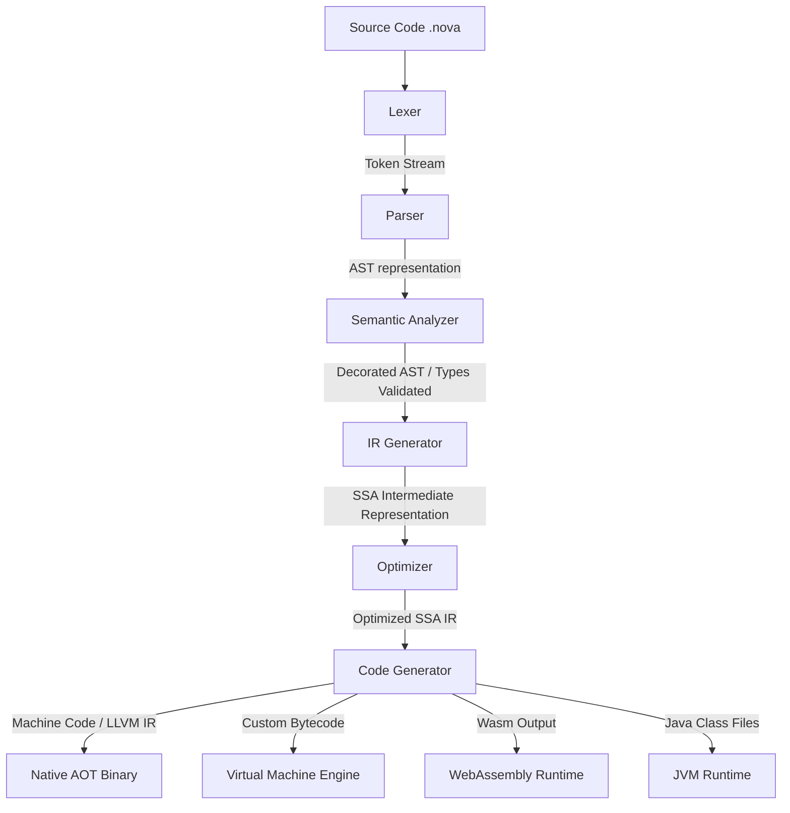

# Software Requirements Specification (SRS)
## Project: NovaLang – Universal Programming Language

---

## Document Control
* **Document Version:** 1.3.0
* **Date:** 2026-06-06
* **Status:** Draft / Under Review
* **Category:** Universal Multi-Paradigm Programming Language and Ecosystem
* **Project Name:** NovaLang

---

## Table of Contents
1. [Introduction](#1-introduction)
   - [1.1 Purpose](#11-purpose)
   - [1.2 Scope](#12-scope)
   - [1.3 Definitions, Acronyms, and Abbreviations](#13-definitions-acronyms-and-abbreviations)
   - [1.4 Intended Audience](#14-intended-audience)
2. [Overall Description](#2-overall-description)
   - [2.1 Product Perspective](#21-product-perspective)
   - [2.2 Compilation and Execution Pipeline](#22-compilation-and-execution-pipeline)
   - [2.3 Product Features](#23-product-features)
   - [2.4 Design and Implementation Constraints](#24-design-and-implementation-constraints)
   - [2.5 Core Design Decisions & Solutions](#25-core-design-decisions--solutions)
3. [Functional Requirements](#3-functional-requirements)
   - [MoSCoW Prioritization Matrix](#moscow-prioritization-matrix)
   - [Core Language Specifications (FR-001 to FR-020)](#core-language-specifications-fr-001-to-fr-020)
4. [Compiler Requirements](#4-compiler-requirements)
   - [4.1 Lexer](#41-lexer)
   - [4.2 Parser](#42-parser)
   - [4.3 Semantic Analyzer](#43-semantic-analyzer)
   - [4.4 Intermediate Representation](#44-intermediate-representation)
   - [4.5 Code Generation & Targets](#45-code-generation--targets)
5. [Virtual Machine Requirements](#5-virtual-machine-requirements)
   - [5.1 VM Architecture](#51-vm-architecture)
   - [5.2 Garbage Collection & Memory Protection](#52-garbage-collection--memory-protection)
6. [Package Manager (`nova`)](#6-package-manager-nova)
   - [6.1 Project Configuration (`nova.toml`)](#61-project-configuration-novatoml)
   - [6.2 Command Reference](#62-command-reference)
7. [Standard Library Specification](#7-standard-library-specification)
8. [Database Support Specification](#8-database-support-specification)
9. [Networking Support Specification](#9-networking-support-specification)
10. [AI/ML Support Specification](#10-aiml-support-specification)
11. [Security Requirements](#11-security-requirements)
12. [Performance Requirements](#12-performance-requirements)
13. [IDE Support Specification](#13-ide-support-specification)
14. [Future Scope](#14-future-scope)
15. [Success Criteria & Verification Plan](#15-success-criteria--verification-plan)

---

## 1. Introduction

### 1.1 Purpose
NovaLang is a modern, multi-paradigm programming language designed to unify systems programming, scripting, application development, AI/ML development, web development, and embedded programming into a single cohesive ecosystem. 

The language aims to eliminate the classic trade-off between execution speed and developer velocity:
* **High Performance:** Compiles directly to bare-metal native binaries with near-zero runtime overhead.
* **Easy Scripting:** Supports lightweight, dynamically typed variables, REPL execution, and minimal boilerplate for scripts.
* **Cross-Platform Support:** Deploys seamlessly on desktop, mobile, cloud, web (WebAssembly), and resource-constrained microcontrollers.
* **Typing Flexibility:** Allows seamless coexistence of compile-time type-safety (static typing) and runtime flexibility (dynamic typing).
* **Multi-Paradigm Engine:** Native support for Object-Oriented, Functional, and Procedural paradigms.
* **Safety First:** Combines compiler-enforced memory safety with optional, explicitly marked unsafe operations.

### 1.2 Scope
NovaLang provides a full developer experience out of the box, encompassing:
* **Compiler & Interpreter:** Dual support for AOT native binaries, JIT compilation, and interpreter modes.
* **Package Manager & Build System:** A unified packaging, dependency, and project lifecycle management system.
* **Standard Library:** Batteries-included library supporting typical data structures, HTTP client/server, concurrency, cryptography, and databases.
* **Developer Tooling:** Built-in REPL, testing engine, debugger protocol, and an LSP-compliant Language Server.
* **Specialized Libraries:** Embedded modules, database connectors, and optimized tensor calculation APIs for AI/ML tasks.

#### Supported Platforms
* **Desktop:** Windows, Linux, macOS
* **Mobile:** Android, iOS
* **Web:** WebAssembly (Wasm)
* **Embedded:** Microcontrollers, IoT systems

### 1.3 Definitions, Acronyms, and Abbreviations
* **AOT:** Ahead-of-Time compilation (compiling code into native machine instructions before execution).
* **AST:** Abstract Syntax Tree (hierarchical representation of source code structure).
* **GC:** Garbage Collector (automatic runtime memory manager).
* **IR:** Intermediate Representation (abstract language representation utilized by optimizer/compiler backends).
* **JIT:** Just-in-Time compilation (compiling bytecode into machine code dynamically during runtime).
* **LSP:** Language Server Protocol (industry standard protocol enabling editor support).
* **REPL:** Read-Eval-Print Loop (interactive shell).
* **SSA:** Static Single Assignment (compiler IR format where every variable is assigned exactly once).
* **VM:** Virtual Machine (bytecode execution engine).

### 1.4 Intended Audience
This document serves as the primary technical specification for compiler engineers, core library contributors, VM developers, and tooling maintainers building the NovaLang language ecosystem.

---

## 2. Overall Description

### 2.1 Product Perspective
NovaLang is a self-contained programming ecosystem that interfaces with native OS kernels, standard system runtimes, microcontrollers, and cloud-native container infrastructures. 

```text
NovaLang Ecosystem
├── Compiler (AOT & JIT)
├── Interpreter (REPL & VM)
├── Virtual Machine (Stack-based runtime)
├── Package Manager & Build System (nova)
├── Standard Library (std.*)
├── Language Server Protocol (LSP)
├── Debugger Interface
├── Documentation Generator
└── Testing Framework
```

### 2.2 Compilation and Execution Pipeline
The following pipeline describes how source files (`.nova`) are processed and compiled/executed:



### 2.3 Product Features
#### Core Capabilities
* **Native Compilation:** Emits target-optimized native code via LLVM.
* **Bytecode Compilation:** Emits compact intermediate bytecode (.novac) for execution on the Virtual Machine.
* **Interpretation:** On-the-fly execution via VM interpreter for scripts and the REPL.
* **JIT Compilation:** Dynamically compiles hot code pathways to native code at runtime inside the VM.
* **Garbage Collection:** Modern, thread-local, low-pause garbage collector.
* **Memory Management:** Hybrid scheme (compiler ownership checks + local GC).
* **Multithreading:** Safe, data-race-free multithreading model.
* **Async Programming:** Native `async`/`await` powered by non-blocking event loops.
* **Reflection:** Runtime metadata access for interfaces, classes, and types.
* **Generics:** Parameterized types validated at compile-time.
* **Macros:** Compile-time AST-manipulating macro system.

### 2.4 Design and Implementation Constraints
1. **Gradual Typing Coexistence:** Static typing and dynamic typing must interoperate without type-safety holes. Dynamically typed values are checked at boundaries using runtime assertions.
2. **Deterministic Startup Time:** Execution initialization must be lightweight, prioritizing VM startup in under 50ms.
3. **Embedded Target Restrictions:** Compiling for embedded targets must disable reflection, JIT, and Garbage Collection, utilizing static compile-time memory layouts instead.

### 2.5 Core Design Decisions & Solutions
To balance opposing operational requirements, NovaLang adopts the following architectural design choices:

| Dimension / Conflict | Challenge | Resolution / Design Choice |
| :--- | :--- | :--- |
| **Static vs. Dynamic Typing** | Static typing provides safety and compiler optimization, while dynamic typing offers ease of scripting and rapid prototyping. | **Optional Typing (Gradual Typing)**: Variables can be declared with explicit static types. Dynamic variables do not use the `var` keyword; they are declared implicitly using automatic type detection (untyped assignment) and checked dynamically at runtime. |
| **Interpreted vs. Maximum Speed** | Interpreted execution is ideal for scripts and interactive REPLs, whereas execution speed requires highly optimized native compilation. | **VM + JIT Compilation**: A Virtual Machine executes bytecode instantly for scripting/REPL tasks, while a dynamic JIT compiler compiles hot execution paths to native code at runtime. |
| **Memory Safety vs. Raw Hardware Access** | Automatic memory safety prevents reference errors, but systems and embedded programming require raw hardware access. | **Safe Mode + Unsafe Blocks**: Standard application code runs in a memory-safe environment (GC/ownership), but systems code can perform low-level operations in explicit `unsafe` blocks. |
| **Simple Syntax vs. Feature Richness** | Simple syntax ensures ease of learning and tool parsing, whereas rich syntax provides convenience and powerful language abstractions. | **Optional Advanced Features**: The core language syntax remains simple and streamlined. Advanced syntax features (e.g., macros, reflection) are kept optional, explicit, or modular. |

---

## 3. Functional Requirements

### MoSCoW Prioritization Matrix
To align scope and developmental phases, all functional requirements are grouped into priority categories:

| Must Have (M) | Should Have (S) | Could Have (C) | Won't Have (W) |
| :--- | :--- | :--- | :--- |
| Variable Declaration (FR-001) | Lambda Functions (FR-009) | Reflection (FR-016) | Inline C Macro Expansion |
| Static Typing (FR-002) | Pattern Matching (FR-010) | Unsafe Operations (FR-018) | |
| Dynamic Typing (FR-003) | Async Programming (FR-014) | Assembly Support (FR-020) | |
| Functions (FR-004) | Multithreading (FR-015) | | |
| Classes (FR-005) | C Interoperability (FR-019) | | |
| Interfaces (FR-006) | | | |
| Inheritance (FR-007) | | | |
| Generics (FR-008) | | | |
| Modules & Packages (FR-011, -012)| | | |
| Exception Handling (FR-013) | | | |
| Memory Management (FR-017) | | | |

---

### Core Language Specifications (FR-001 to FR-020)

#### FR-001 Variable Declaration
* **Description:** Support declaration of read-only variables using `let` and mutable/dynamic variables using explicit type annotation or automatic type detection (without keywords).
* **Example:**
  ```typescript
  let name = "Manik"    // Read-only binding
  age: Int = 21         // Mutable statically-typed variable (no keyword required)
  value = 21            // Dynamic variable using automatic type detection
  ```

#### FR-002 Static Typing
* **Description:** Support compile-time type verification for annotated variables.
* **Example:**
  ```typescript
  let age: Int = 20
  // age = "twenty" -> Compiler error: Type mismatch (Expected Int, got String)
  ```

#### FR-003 Dynamic Typing
* **Description:** Support runtime typing where types are checked during execution.
* **Example:**
  ```typescript
  value = "Hello"       // Dynamic variable declared via automatic type detection
  value = 100           // Variable can be reassigned to a different type at runtime
  ```

#### FR-004 Functions
* **Description:** Support definition of reusable functions with typed arguments and return types.
* **Example:**
  ```typescript
  fun add(a: Int, b: Int): Int {
      return a + b
  }
  ```

#### FR-005 Classes
* **Description:** Support structural declaration of custom classes, constructors, and properties.
* **Example:**
  ```typescript
  class User {
      name: String      // Property declaration (no 'var' keyword required)
      
      init(name: String) {
          self.name = name
      }
  }
  ```

#### FR-006 Interfaces
* **Description:** Support declaration of interfaces to define runtime/compile-time behavior contracts.
* **Example:**
  ```typescript
  interface Vehicle {
      fun start()
  }
  ```

#### FR-007 Inheritance
* **Description:** Support single-class inheritance and interface implementation.
* **Example:**
  ```typescript
  class Car extends Vehicle {
      fun start() {
          print("Engine started")
      }
  }
  ```

#### FR-008 Generics
* **Description:** Provide parameterized class and function declarations with compile-time type checks.
* **Example:**
  ```typescript
  class Box<T> {
      value: T          // Property declaration (no 'var' keyword required)
      
      init(value: T) {
          self.value = value
      }
  }
  ```

#### FR-009 Lambda Functions
* **Description:** Support first-class anonymous functions with capture bindings.
* **Example:**
  ```typescript
  let square = (x: Int) => x * x
  ```

#### FR-010 Pattern Matching
* **Description:** Support structural data destructuring and condition branches.
* **Example:**
  ```rust
  match value {
      1 => print("One")
      _ => print("Other")
  }
  ```

#### FR-011 Modules
* **Description:** Allow isolation of namespaces using files and folders.
* **Example:**
  ```typescript
  import math
  let result = math.sqrt(16.0)
  ```

#### FR-012 Packages
* **Description:** Support logical naming namespaces mapping to package targets.
* **Example:**
  ```typescript
  package user.auth
  ```

#### FR-013 Exception Handling
* **Description:** Provide robust try-catch mechanisms for runtime exceptions.
* **Example:**
  ```typescript
  try {
      let result = 10 / 0
  }
  catch(e: DivisionByZeroError) {
      print("Cannot divide by zero")
  }
  ```

#### FR-014 Async Programming
* **Description:** Support async routines and cooperative scheduling.
* **Example:**
  ```typescript
  async fun fetchData(): String {
      let data = await net.get("https://api.example.com")
      return data
  }
  ```

#### FR-015 Multithreading
* **Description:** Support parallel thread spawning with memory access restrictions.
* **Example:**
  ```typescript
  thread.start(fun() {
      print("Executing thread task")
  })
  ```

#### FR-016 Reflection
* **Description:** Support inspecting structure, methods, and attributes of objects at runtime.
* **Example:**
  ```typescript
  let t = reflect.type(user)
  print(t.name) // "User"
  ```

#### FR-017 Memory Management
* **Description:** Provide safe automated memory management via thread-local garbage collectors.
* **Example:**
  ```typescript
  // Dynamically allocated buffers are tracked and auto-collected by GC
  let buffer = memory.alloc(1024)
  ```

#### FR-018 Unsafe Operations
* **Description:** Support raw pointer arithmetic and manual memory bypasses.
* **Example:**
  ```rust
  unsafe {
      let ptr = get_raw_pointer()
      ptr.write(255)
  }
  ```

#### FR-019 C Interoperability
* **Description:** Support native loading and calling of shared C libraries without overhead.
* **Example:**
  ```c
  extern c {
      fun printf(format: String, ...args)
  }
  ```

#### FR-020 Assembly Support
* **Description:** Direct inline assembly commands injection into native builds.
* **Example:**
  ```assembly
  asm {
      MOV AX, 10
  }
  ```

---

## 4. Compiler Requirements

### 4.1 Lexer
The lexer converts stream characters into structured lexical tokens, filtering comments and whitespace.

* **Error Recovery:** In the event of invalid characters, the Lexer reports descriptive compiler diagnostics with exact line numbers, file indexes, and character hints.
* **Example Syntax:**
  ```typescript
  let age = 20
  ```
* **Output Stream:**
  `[LET, IDENTIFIER("age"), ASSIGN, INTEGER(20)]`

### 4.2 Parser
The parser processes the token stream to construct a valid Abstract Syntax Tree (AST).

* **Error Recovery:** Uses synchronizing tokens (e.g., semicolons, closing brackets) to recover from syntax errors and generate multiple diagnostic messages instead of halting on the first error.
* **Example AST:**
  ```text
  AssignmentNode
   ├─ Target: IdentifierNode("age")
   └─ Source: IntegerLiteralNode(20)
  ```

### 4.3 Semantic Analyzer
Verifies scope bindings, resolves types, enforces interface compliance, and performs data flow validation.

* **Responsibilities:**
  * Enforce typing constraints.
  * Guarantee variable initialization safety before read access.
  * Validate ownership and borrow states for zero-cost memory allocations.

### 4.4 Intermediate Representation
Translates the AST into Static Single Assignment (SSA) format to facilitate optimization steps.

* **IR Layout Example:**
  ```text
  %1 = load %a
  %2 = load %b
  %3 = add %1 %2
  store %3 %c
  ```

### 4.5 Code Generation & Targets
The code generator optimizes and translates the optimized SSA IR to target instructions:
* **Native:** Emits direct binary binaries via LLVM backend.
* **Bytecode VM:** Compiles to custom Nova VM instructions (`.novac`).
* **Java Virtual Machine:** Generates valid JVM class bytecodes.
* **WebAssembly:** Compiles to stand-alone `.wasm` modules.

---

## 5. Virtual Machine Requirements

### 5.1 VM Architecture
The Nova Virtual Machine (NovaVM) is a high-performance, stack-based bytecode interpreter and JIT compiler.

* **Operand Stack:** Standard LIFO stack tracking execution contexts.
* **Local Registers:** Local workspace storing registers to keep arguments and local variables.
* **Frame Engine:** Call frames containing method references, execution program counter (PC), and local variables.

### 5.2 Garbage Collection & Memory Protection
* **Garbage Collection:** Employs a Generational Copying Garbage Collector.
* **Thread Locality:** Most allocations happen in thread-local nurseries to reduce global locks.
* **GC Target Pause Time:** Guaranteed GC pauses below 5ms for soft real-time operations.

---

## 6. Package Manager (`nova`)

### 6.1 Project Configuration (`nova.toml`)
A manifest file governs project dependencies, configurations, compile targets, and metadata.

```toml
[package]
name = "my_project"
version = "0.1.0"
authors = ["Manik Patra <manikpatra409@gmail.com>"]
edition = "2026"

[dependencies]
http = "1.0.0"
json = { version = "1.2.0", git = "https://github.com/nova-lang/json" }
```

### 6.2 Command Reference
The CLI tool serves as both package manager and task orchestrator:

* `nova init`: Initializes a standard directory structure for an application/library.
* `nova build`: Compiles source code in `.nova` files into target outputs.
* `nova run`: Compiles and executes the current package.
* `nova install <package>`: Installs a remote library package to the project cache.
* `nova publish`: Submits the package to the official central repository registry.

---

## 7. Standard Library Specification

* **`std.io`:** Standard input, output stream wrappers, and file handles.
* **`std.math`:** High-precision basic operations and trigonometric functions.
* **`std.string`:** Unicode string operations, formatting, and regular expressions.
* **`std.collection`:** Built-in List, Map, Set, Queue, and Tree structures.
* **`std.net`:** Socket programming, HTTP server, and client implementations.
* **`std.crypto`:** Core encryption (AES, RSA, SHA-2) implementations.
* **`std.database`:** Common query abstractions.
* **`std.json`:** JSON serialization and deserialization engine.
* **`std.xml`:** XML document parsing.
* **`std.ai` & `std.ml`:** High-level APIs for model serving and tensor handling.

---

## 8. Database Support Specification

### Supported Engines
* **Relational:** MySQL, PostgreSQL, SQLite
* **Document-based:** MongoDB

* **Abstractions Example:**
  ```typescript
  import db
  let connection = db.connect("sqlite://local.db")
  let users = connection.query("SELECT * FROM users WHERE status = 'active'")
  ```

---

## 9. Networking Support Specification

Provides native asynchronous support for core communication protocols:
* **Transport Layer:** TCP and UDP sockets.
* **Application Layer:** HTTP/1.1, HTTP/2, WebSocket, gRPC, and MQTT.

---

## 10. AI/ML Support Specification

Optimized mathematical bindings that compile directly into hardware-accelerated kernels (CPU Vector extensions and GPU backends).

### Core Features
* Tensor operations and matrix arithmetic.
* Deep neural network layers.
* Natural Language Processing (NLP) tokenization.
* Image decoding and computer vision manipulation.
* Reinforcement learning environment models.

---

## 11. Security Requirements

* **Authentication:** Built-in standard routines for OAuth2 workflow and JWT encoding.
* **Cryptography:** Validated cryptographic primitives (AES-GCM, RSA-OAEP, SHA-256).
* **Memory Protection:** Safe arrays featuring automatic runtime bounds-checking to prevent buffer overflow attacks.

---

## 12. Performance Requirements

The language compiler and VM are bound by the following performance criteria:

| Requirement Metric | Target Threshold | Description |
| :--- | :--- | :--- |
| **Startup Time** | `< 50ms` | Warmup latency for a basic "Hello World" application. |
| **Compilation Speed** | `< 2 seconds` | Incremental compile benchmark for projects under 10k lines. |
| **Memory Usage** | `< 100MB` | Baseline RAM utilization for the VM process. |
| **Runtime Speed** | Near C/C++ | Benchmarks should be within 1.2x of optimized C++ execution. |
| **GC Pause Time** | `< 5ms` | Maximum execution latency overhead caused by GC passes. |

---

## 13. IDE Support Specification

NovaLang supports standard language tooling using a Language Server Protocol (LSP) daemon:
* **IDE Plugins:** Visual Studio Code, IntelliJ IDEA, Vim, Neovim.
* **LSP Capabilities:**
  * Real-time autocomplete and member listings.
  * Code action refactoring.
  * Inline type annotations and hover documentation.
  * Interactive Debugging Adapter Protocol (DAP) bindings.

---

## 14. Future Scope

The long-term roadmap for NovaLang includes:
* **AI-Assisted Coding:** Built-in token prediction heuristics within the compiler toolchain.
* **Distributed Computing:** Automatic actor mapping for remote node tasks.
* **Quantum Computing:** APIs mapping directly to physical and simulated QPU backends.
* **Blockchain Support:** High-efficiency VM targeting Web3 smart contracts.
* **Graphics & GPU:** Native SIMD and GPU shader compile pipelines.
* **Robotics SDK:** Real-time hardware integration modules.

---

## 15. Success Criteria & Verification Plan

NovaLang development will be validated against a comprehensive verification matrix:

### 15.1 Compiler Test Suite
* **Unit Testing:** Individual tests validating Lexer tokenizing, Parser AST construction, and symbol checks.
* **Bootstrap Validation:** The compiler must eventually compile its own codebase successfully (self-hosting validation).

### 15.2 Performance Benchmarking
* Automated pipeline running performance benchmarks on startup speed, compilation latency, and peak memory usage across Windows, Linux, and macOS platforms.

---
* **Version:** 1.3.0
* **Project Name:** NovaLang
* **Category:** Universal Multi-Paradigm Programming Language and Ecosystem.